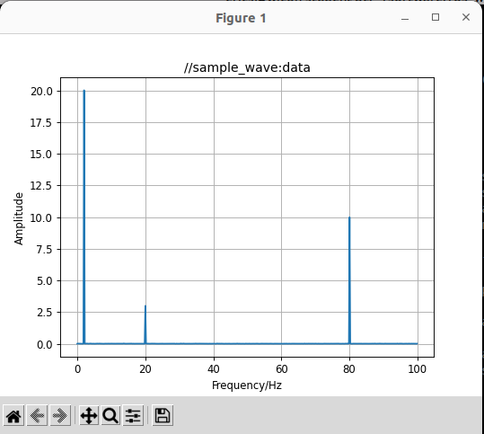
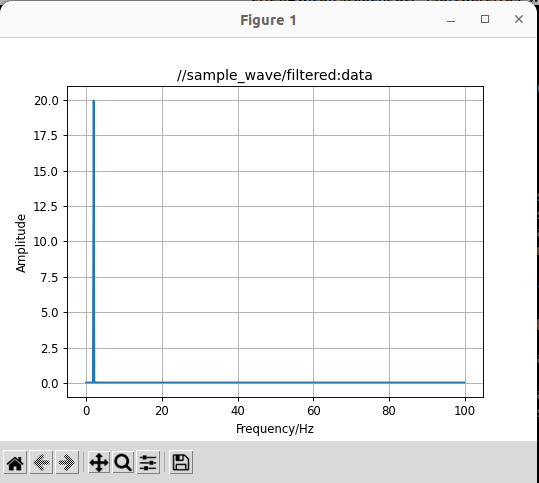
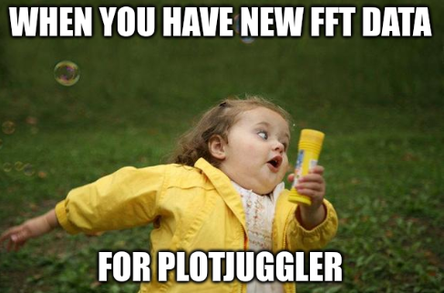

# ROS2 Package for Signal Filtering utilizing FFT

ROS2 package to filter generic time series (e.g. IMU data) using DSP (Digital Signal Processing) tools.

## Table of Contents
1. [About this Repository](#about-this-repository)
2. [Getting Started](#getting-started)
3. [Building and Running](#building-and-running)
4. [Working with this Code](#working-with-this-package)


Example of a lowpass-filtered signal consisting of three white noised sines with different amplitudes, frequencies and phase shifts.

 

And the associated example Fourier plots.

## About this Repository
The repository consists of two standalone packages:
- `sample_signal`: This package allows you to create different signals consisting of various periodic elements enriched by white noise and/or a base signal to test the `filter_signal` package.
- `filter_signal`: This package applies an FFT transform to any specified ROS2 topic (which should be analyzed first) and displays the data in the frequency domain. Based on this analysis, the user can choose a suitable filter and apply it to the live topic to get a filtered result with a small delay.

Both packages are documented with their own README files. It is advised to start with the `sample_signal` package if you are not very familiar with DSP. We also highly recommend using [PlotJuggler](https://plotjuggler.io/) for data visualization purposes. Why wouldn't you!?
<p align="center"> 
 
</p> 

## Getting Started

The current repository tree looks like
```bash
ros2_dsp_filters
    ├── README.md
    ├── filter_signal
    │   ├── CMakeLists.txt
    │   ├── config
    │   ├── filter_config
    │   ├── filter_signal
    │   ├── fourier_config
    │   ├── include
    │   ├── launch
    │   ├── package.xml
    │   ├── README.md
    │   └── src
    └── sample_signal
        ├── CMakeLists.txt
        ├── config
        ├── include
        ├── launch
        ├── LICENSE
        ├── package.xml
        ├── README.md
        ├── sample_signal
        └── src
```

To get started, please read [filter_signal/README.md](./filter_signal/README.md) and [sample_signal/README.md](./sample_signal/README.md).

## Building and Running

### Dependencies

This repository depends on `python3-scipy` and `python3-numpy`, hence please install
```
sudo apt-get install python3-scipy python3-numpy
```
or run `rosdep install --from-paths src -y --ignore-src` within your workspace. 

## Building
0. Create ros2 workspace and source folder, if needed:
```bash
mkdir -p ros2_ws/src
cd ros2_ws/src
``` 
1. Clone the package into the source of your ros2 workspace, source and build:
```bash 
git clone git@github.com:WICON-RPTU/ros2_dsp_filters.git
cd ..
source /opt/ros/humble/setup.bash
colcon build
```
2. To check the default setup run in two different terminals:
```bash 
source /opt/ros/humble/setup.bash
source install/setup.bash
ros2 launch sample_signal launch.py
```
and
```bash 
source /opt/ros/humble/setup.bash
source install/setup.bash
ros2 launch filter_signal filter.launch.py
```
Use Plotjuggler and you should see a result similar to the [example](example.gif) in the beginning of this README.

## Working with this Code

The workflow is

1. Generate a signal using `sample_signal`-package or find another source of a ROS2-message you want to FFT-analyse and/or filter
2. Analyse the ROS2 message which you are publishing using `filter_signal`'s `analyse` functionality
3. Plot the Fourier-Transform of the ROS2 message's components of your choice using `filter_signal`'s `fourier` functionality
4. Design a digital filter for the ROS2 message's components of your choice using `filter_signal`'s `filter` functionality
5. (optional) Plot the Fourier-Transform of both the filtered and the raw ROS2 message using `filter_signal`'s `fourier` functionality again
6. (non-optional) Enjoy a filtered ROS2 message


