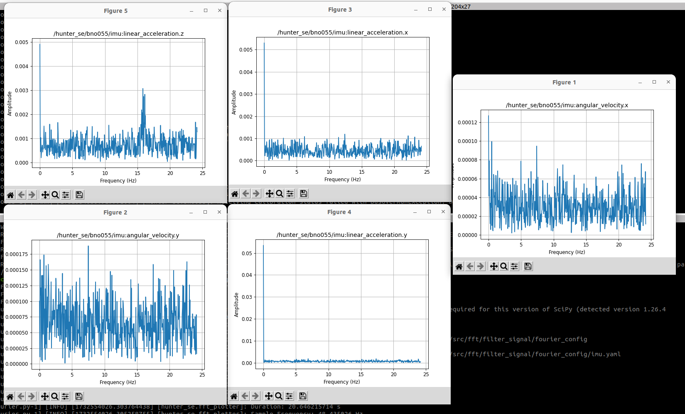

# Filter Signal Package

This package contains tools to signal-process any ROS2 message.

## Table of Contents
1. [About this repository](#about-this-repository)
2. [Getting started](#getting-started)  
3. [Building and Running](#building-and-running)  
    - [Analyse](#analyse)
    - [Filter](#filter)
    - [Fourier](#fourier)


## About this repository

This package contains two executables `analyse.py`, `filter.py` and `fourier.py` to analyse and then signal-process any ROS2 message. Currently
any float part of any message can be filtered with

- Highpass
- Lowpass
- Bandpass
- Bandstop

based on your configuration. 

## Getting started

The current package looks like
```bash
filter_signal
    ├── CMakeLists.txt
    ├── config
    │   ├── analyse.yaml
    │   └── filter.yaml
    ├── filter_config
    │   ├── float32.yaml
    │   └── imu.yaml
    ├── filter_signal
    │   ├── __init__.py
    │   ├── analyse_parameters.py
    │   ├── analyse.py
    │   ├── filter_parameters.py
    │   ├── filter.py
    │   ├── filters.py
    │   └── utilities.py
    ├── include
    ├── launch
    │   ├── analyse.launch.py
    │   └── filter.launch.py
    ├── package.xml
    ├── README.md
    └── src
```

Ignore `src` and `include`, they are only part of the used template to add CPP-files in the package later on.


## Building and Running
Note that this package depends on `python3-scipy`, hence please install

```
sudo apt-get install python3-scipy
```

or run `rosdep install --from-paths src -y --ignore-src` within your workspace. To build, please navitage into your workspace (adapt the first line in case it is different than `ros_ws`) and run

```bash
cd ros_ws
source /opt/ros/humble/setup.bash
colcon build
```

If you are using `colcon build --symlink-install` or e.g. using VSCode ROS2 Extention please make sure that all executable python files in
`ros_ws/src/fft/filter_signal/filter_signal` `filter.py` and `analyse.py` are made executable. Hence run

```bash
chmod +x filter.py
chmod +x analyse.py
chmod +x fourier.py
```

Remember that only message types can be analysed and filtered that are also sourced. Hence if there is an interface package in your workspace (not installed in /opt/ros), make sure to also source the workspace before running. To run, proceed with [Analyse](#analyse) and [Filter](#filter). Note there exists `analyse.launch.py`, `filter.launch.py` and `fourier.launch.py` launch files with associated `analyse.yaml`, `filter.yaml` and `fourier.yaml` configuration files for orientation.

### Analyse

Because any message type is supported, to filter a message you first have to analyse it. `analyse.py` will subscribe to a `topic` of your choice of arbitrary message type (as long as the message definition is sourced). It will then write the structure of the message as `result_file_name.yaml` into a specified `config_path`. The parameter:default_value are as following:

- `topic`:`imu`
- `config_path`:`~`
- `result_file_name`:`analytic_result` 

where `~` is the home-directory of the user executing the code. E.g. result file for a `sensor_msgs.msg.Imu` looks like this:

```bash
angular_velocity:
  x: 0.0
  y: 0.0
  z: 0.0
angular_velocity_covariance:
- 0.0
- ...
- 0.0
header:
  frame_id: imu_frame
  stamp:
    nanosec: 413849829
    sec: 1732097342
linear_acceleration:
  x: 0.0
  y: 0.0
  z: 0.0
linear_acceleration_covariance:
- 0.0
- ...
- 0.0
orientation:
  w: 1.0
  x: 0.0
  y: 0.0
  z: 0.0
orientation_covariance:
- 0.0
- ...
- 0.0
```

While the resulting file will be of type `.yaml`, do not include the file ending `.yaml` in the parameter `result_file_name`. The file ending will be added automatically.

### Filter

`filter.py` will subscribe to a topic of your choice and filter the topic according to the configuration file. The parameter:default_value are as following:

- `topic`:`imu`
- `config_path`:`~`
- `config_file_name`:`imu` 

where `~` is the home-directory of the user executing the code. Now, given the `analytic_result` from [Analyse](#analyse), we can edit it to become a `config_file` for the filter. 
For example, take the result file for an `sensor_msgs.msg.Imu`, and assume you want to filter 

- `angular_velocity.x` with a **lowpass** filter of **4**th order and a cuttoff-frequency of **20.0Hz**
- `angular_velocity.y` with a **highpass** filter of **2**nd order and a cuttoff-frequency of **1.0Hz**
- `linear_acceleration.x` with a **bandpass** filter of **3**rd order and a frequency band of **[5.0, 10.0]Hz**
- `linear_acceleration.z` with a **bandstop** filter of **2**nd order and a frequency band of **[3.0, 3.5]Hz**

then you would edit the file to look like:

```bash
angular_velocity:
  x: ['lowpass', 20.0, 4]
  y: ['highpass', 1.0, 2]
  z: 0.0
angular_velocity_covariance:
- 0.0
- ...
- 0.0
header:
  frame_id: imu_frame
  stamp:
    nanosec: 413849829
    sec: 1732097342
linear_acceleration:
  x: ['bandpass', [5.0, 10.0], 3]
  y: ['bandstop', [3.0, 3.5], 2]
  z: 0.0
linear_acceleration_covariance:
- 0.0
- ...
- 0.0
orientation:
  w: 1.0
  x: 0.0
  y: 0.0
  z: 0.0
orientation_covariance:
- 0.0
- ...
- 0.0
```

and load the edited file as the `filter` config file. While the configuration file will be of type `.yaml`, do not include `.yaml` in the parameter value `config_file_name`, 
the file ending will be added automatically. Once the node is running it will publish into `topic/filtered`.

### Fourier

`fourier.py` will subscribe to a topic of your choice and perform a Fast-Fourier Transform of the signal according to the configuration file. The parameter:default_value are as following:

- `topic`:`sample_signal`
- `number_of_samples`: 1000
- `config_path`:`~`
- `config_file_name`:`float32` 

where `~` is the home-directory of the user executing the code. Now, given the `analytic_result` from [Analyse](#analyse), we can edit it to become a `config_file` for the filter. 
For example, take the result file for an `sensor_msgs.msg.Imu`, and assume you want to see a Fourier-Analysis of  

- `angular_velocity.x`
- `angular_velocity.y`
- `linear_acceleration.x`
- `linear_acceleration.z`

then you would edit the file to look like:

```bash
angular_velocity:
  x: True
  y: True
  z: 0.0
angular_velocity_covariance:
- 0.0
- ...
- 0.0
header:
  frame_id: imu_frame
  stamp:
    nanosec: 413849829
    sec: 1732097342
linear_acceleration:
  x: True
  y: 0.0
  z: True
linear_acceleration_covariance:
- 0.0
- ...
- 0.0
orientation:
  w: 1.0
  x: 0.0
  y: 0.0
  z: 0.0
orientation_covariance:
- 0.0
- ...
- 0.0
```
and load the edited file as the `filter` config file. While the configuration file will be of type `.yaml`, do not include `.yaml` in the parameter value `config_file_name`, 
the file ending will be added automatically. The code will be running until it has saved all `number_of_samples` and then plot the result, e.g.:

 FFT result of real-world IMU data