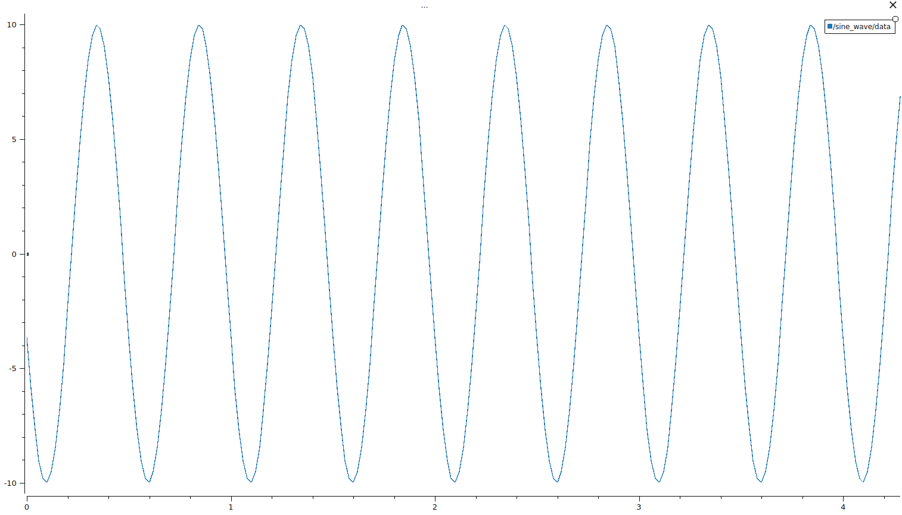
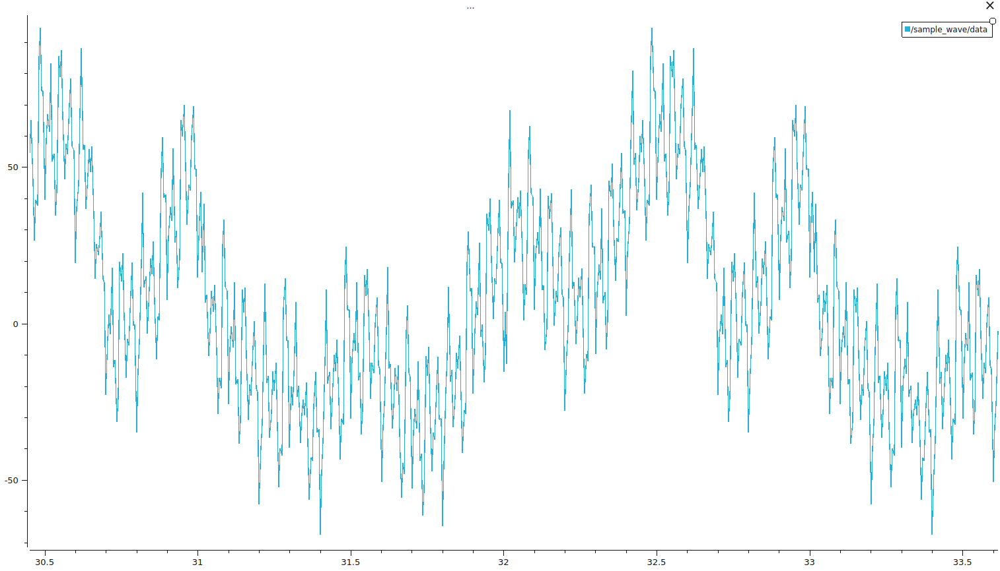

# ROS2 package for generating Sample Signal Messages

Contains code to generate sample signals to test `filter_signal` package capabilities.

## Table of Contents
1. [About this repository](#about-this-repository)
2. [Getting started](#getting-started)
3. [Building and Running](#building-and-running)
4. [License](#license)


## About this package

Python executable `sample_signal.py` generates a sample signal in `std_msgs.msg.Float32`. The `launch.py` runs `sample_signal.py` with a configuration that allows you generate an arbitrary combination of 

- sine wave
- square wave
- triangle wave
- sawtooth wave
- pulse wave

with or without white/brown noise and a base signal that can have linear of exponential growth.

Another python executable `imu.py` allows to populate any specified field of the `sensor_msgs.msg.Imu` with the data generated by the `sample_signal.py` to provide a sample Imu topic for the `filter_signal` package to show how to apply DSP filters on any ROS2 topic type. `imu.launch.py` runs `imu.py` where user can specify an Imu topic field in the configuration file. Not a worst idea not only to change `imu.yaml`, but the `imu.py` itself by populating more then one field to test how different filters are influencing the sample signal.

## Getting started

The current package looks like

```bash
sample_signal
    ├── CMakeLists.txt
    ├── config
    │   └── sample_signal.yaml
    ├── include
    ├── launch
    │   └── launch.py
    ├── LICENSE
    ├── package.xml
    ├── README.md
    ├── sample_signal
    │   ├── __init__.py
    │   ├── imu.py
    │   ├── sample_signal.py
    │   └── sine_wave.py
    └── src
```

Ignore `src` and `include`, they are only part of the used template to add CPP-files in the package later on.  


## Building and Running
To build, please navitage into your workspace (adapt the first line in case it is different than `ros_ws`) and run

```bash
cd ros_ws
source /opt/ros/humble/setup.bash
colcon build
```

If you are building with `--symlink-install` flag or e.g. using VSCode ROS2 Extention please make sure that all executable python files in `ros_ws/src/ros2_dsp_filter/sample_signal/sample_signal` `sample_signal.py` and `imu.py` are made executable. Hence run

```bash
cd ros_ws/src/ros2_dsp_filter/sample_signal/sample_signal
chmod +x sample_signal.py
chmod +x imu.py
```

Now, source your workspace and try
```bash
source install/setup.bash
ros2 run sample_signal imu.py
```
to get an empty `sensor_msgs.msg.Imu` publisher, run

```bash
source install/setup.bash
ros2 run sample_signal sine_wave.py
```



to get a sine wave of your chosen amplitude, frequency at your chosen topic and sample rate, and finally launch

```bash
source install/setup.bash
ros2 launch sample_signal launch.py
```

to generate a sample signal with e.g. an overlaying signals of types:

1. Sine at
  - 2Hz, 20 Amplitude, 0rad phase shift
  - 80Hz, 10 Amplitude, 1.57rad phase shift
  - 20Hz, 3 Amplitude, 3.14rad phase shift
2. Square wave
  - 0.5Hz, 25 Amplitude
3. Triangle wave
 - 30Hz, 24 Amplitude
4. Sawtooth Wave
 - 1.5Hz, 20 Amplitude
5. Pulse Wave 
  - 15Hz, 15 Amplitude, 0.5 Duty Cycle


at 200Hz publishing rate:



# License

This project is primarily licensed under the **BSD 3-Clause License**.

## Dependencies

This project makes use of the following dependencies which are licensed under the Apache License, Version 2.0:

- **rclpy**
- **std_msgs**
- **sensor_msgs**

These dependencies are part of the ROS 2 framework. You may obtain a copy of the License at:

[apache.org/licenses/LICENSE-2.0](http://www.apache.org/licenses/LICENSE-2.0)

The use of these components does not affect the BSD-3 licensing of the original code in this project. However, the following notice must be adhered to for these dependencies:

**Compliance**:
If you modify any of the Apache 2.0 licensed code, you must indicate your modifications in those files or within the documentation provided with the software.